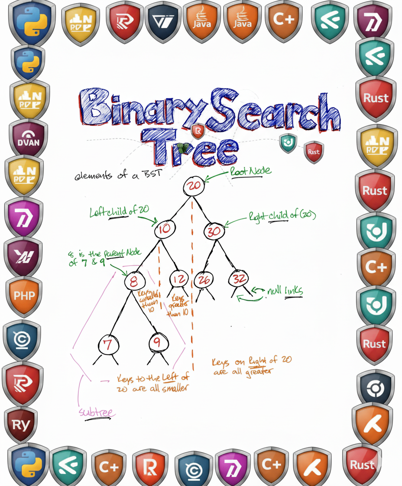

<!-- Banner (use o arquivo que você enviou, recomendo subir ao seu repositório pessoal) -->

<h1 align="center">Olá 👋, eu sou Luiz Oryone Moraes Lira</h1>

  <strong>Desenvolvedor Full Stack | Especialista Técnico | Lifelong Learner</strong>  

  

---

## 📌 Sobre Mim

Profissional de TI com mais de 20 anos de experiência em suporte técnico e operações administrativas. Desde 2017, foco total no **desenvolvimento de software Full Stack** e **automação**, com conhecimento em bancos de dados, IA generativa e tecnologias web modernas.

🧠 Aprendizado contínuo, habilidades multidisciplinares e mentalidade empreendedora completam meu perfil profissional.

---

## 🛠️ Tecnologias & Ferramentas

  

---

## 🎓 Formação Acadêmica

- 🎓 Tecnólogo em Análise e Desenvolvimento de Sistemas – *UNIFATECIE* (2024 – 2026)
- 🎓 Tecnólogo em Ciências do Futuro – *UNIFATECIE* (2024 – 2026)
- 🎓 Bacharelado em Sistema de Informação – *UNIFATECIE* (2025 – 2028)
- 🎓 Técnico em Manutenção e Suporte de TI | Desenvolvedor Full Stack – *SENAI* (2023 – 2024)

---

## 👨‍💻 Experiência Profissional

### Especialista Técnico – FACITEC / Estácio de Sá (2001 – 2021)
- Manutenção de impressoras industriais (Ricoh, Xerox, Sharp)
- Suporte de TI para infraestrutura acadêmica
- Treinamento de equipes e atendimento interno

### Assistente Administrativo e de RH – WCA Contabilidade (1998 – 2013)
- Gestão de folha, contas e suporte a RH
- Digitalização de processos contábeis e administrativos

### Instrutor Freelancer – Escola Infantil Arco Íris (1996 – 1998)
- Aulas extracurriculares de informática e inglês
- Atuação pedagógica com orientação familiar

---

## 📚 Habilidades Técnicas

- **Full Stack Web**: HTML, CSS, JS, Angular, Node.js
- **Linguagens**: Python (80/100), JS (80/100), Delphi (85/100), PHP (30/100)
- **Bancos de Dados**: MySQL, SQL Server
- **Ferramentas**: VSCode, Git, GitHub, Excel (Avançado + VBA)
- **IA Generativa**: Codificação assistida, conteúdo educacional, prompt engineering
- **Soft Skills**: Ética, LGPD, pensamento analítico, resolução de problemas

---

## 📈 GitHub Insights

  

  

---

## 📊 Atividades Recentes

  

---

## 🏆 Troféus de Perfil

  

---

## 🌍 Idiomas

- 🇬🇧 **Inglês** – Avançado  
- 🇩🇪 **Alemão** – Básico

---

## 🔗 Contato & Links

- 📧 Email: [luizoryone@gmail.com](mailto:luizoryone@gmail.com)
- 💼 LinkedIn: [linkedin.com/in/luizoryone](https://linkedin.com/in/luizoryone)
- 🌐 Portfólio: _[em desenvolvimento]_ ou [GitHub](https://github.com/luizoryone)

---

## 🎯 Metas em Andamento

- [x] Concluir formação Full Stack no SENAI
- [ ] Desenvolver projeto com IA Generativa
- [ ] Participar de projetos Open Source
- [ ] Publicar biblioteca ou pacote útil no GitHub

---

> 💡 *Seja bem-vindo(a) ao meu espaço de código, aprendizado e inovação!*

